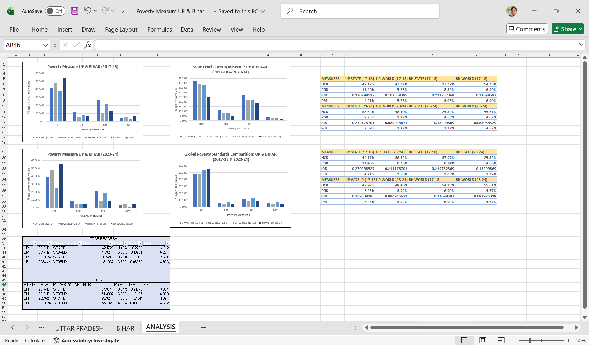

# poverty-dynamics-UP-Bihar
**Project Name:** Comparative Poverty Dynamics: A Multidimensional Study of Uttar Pradesh and Bihar (2017–2024)

**Description:** Conducted a comprehensive comparative analysis of poverty metrics in Uttar Pradesh and Bihar across two time periods (2017–18 and 2023–24). The study evaluated the effectiveness of poverty reduction by tracking key indices, including the Head Count Ratio (HCR), Poverty Gap Ratio (PGR), and the Foster-Greer-Thorbecke (FGT) index.

**Key highlights of the analysis included:**

* **Metric Evaluation:** Benchmarked state-level poverty lines against global (World) standards to identify regional disparities.
* **Trend Analysis:** Documented a significant reduction in state-level HCR in Bihar from 37.97% to 25.32%, alongside improvements in the depth of poverty.
* **Data Interpretation:** Identified a "clustering" effect where populations moved out of severe poverty but remained near global thresholds, as evidenced by falling PGR despite stagnant World HCR figures.
* **Policy Insights:** Analysed how divergent results between state and global standards suggest varying relative stringencies in poverty line definitions.
